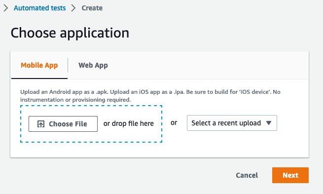

# Airtest on AWS DeviceFarm(ADF)

## Project Structure
1. Template: for ADF test project yaml template
2. test_package: for generate ADF test package

## How to Run
1. Copy your Airtest Project into test_package folder, rename your script entry file as "airtest.py".
2. run `./package_test.sh` to generate ADF test package.
3. Following below steps to run ADF test on AWS management console:
> Upload the APK for the test here, It will be automatically install on the device before the test begin.

> Upload test_with_adb.zip file here, which generated in step 2

> During Configure Step, select "Appium Python" as test framework, select "run your test in custom environment", edit yaml and copy paste the content from template/test.yaml

4. Go through the rest of steps, and that's all of it!

## Advance configuration (Optional)
### customize execution
Check template/test.yaml file for test/command section. the current trigger of test is simply `- python airtest.py`.
You could start customize here for test execution.

### import more python dependency
It is managed on test_package/requirements.txt, currently only includes packages for airtest and pcocoui.
You could regenerate it by `pip freeze`, check more details on [This Page](https://docs.aws.amazon.com/devicefarm/latest/developerguide/test-types-appium.html)